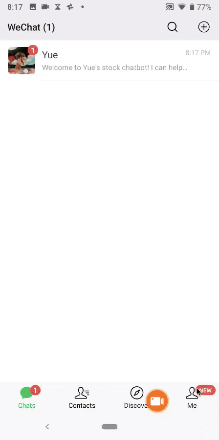

# AI-project
-This is a chatbot that can answer questions on stock price, trading volume and marketing value. 

-The chatbot is integrated into Wechat, using iexfiance API.

-Users are only allowed to send text or audio to ask questions.

## DEMO
-Text test and audio test show the results of this product.
-Below is the demo of text test. The user aks question through text. 
- 
-https://youtu.be/VchJBKMimYo
- This demo is the audio test from chatbot perspective. The user aks audio questions. 
-
https://youtu.be/5-321E-vq4k

